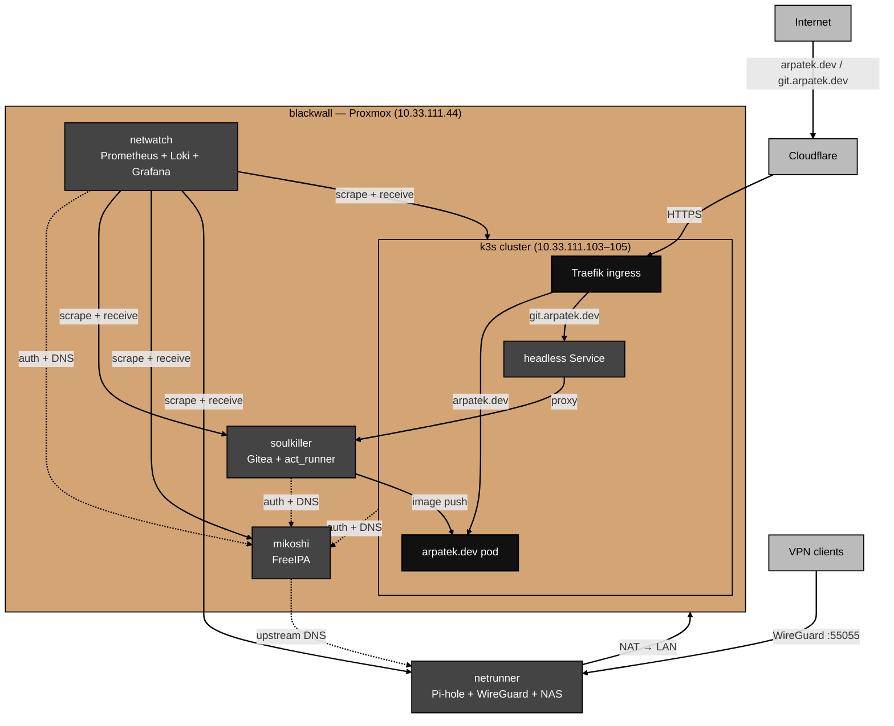

# Architecture

What the home.arpa lab is, host by host, and how the services fit together.

For the rationale behind specific choices, see the `decisions.md` in each service directory.
For issues encountered during builds, see each service's `gotchas.md`.
For the hostname naming convention and migration history, see [docs/hostnames.md](hostnames.md).

## Lab overview

A single Proxmox VE host (`blackwall`, `10.33.111.44`) runs all virtual machines.
There is no cluster, no HA, and no live migration.
This is a single-node homelab.

## Hosts

| Host | IP | OS | Role |
| ---- | -- | -- | ---- |
| `blackwall` | `10.33.111.44` | Proxmox VE 9.1.9 | Hypervisor |
| `mikoshi` | `10.33.111.100` | Rocky Linux 9.7 | Identity (FreeIPA) |
| `soulkiller` | `10.33.111.101` | Debian 13.3 | Git + CI (Gitea) |
| `netwatch` | `10.33.111.102` | Debian 13.3 | Observability (PLG) |
| `erebus` | `10.33.111.103` | Debian 13.3 | k3s control plane |
| `sandevistan` | `10.33.111.104` | Debian 13.3 | k3s worker |
| `kerenzikov` | `10.33.111.105` | Debian 13.3 | k3s worker |
| `netrunner` | `10.33.111.141` | Raspberry Pi OS | DNS + DHCP + VPN + NAS |

## Services

**FreeIPA** — identity, authentication, and DNS authority for `home.arpa`.
Every VM is enrolled as an IPA client.
SSH access and sudo are governed by HBAC rules, not local user accounts.
BIND provides authoritative DNS for the `home.arpa` zone and uses Pi-hole as its upstream forwarder.

**Pi-hole** — network-wide DNS resolver, DHCP server, and content filter.
Handles DHCP for the `10.33.111.0/24` network and the `10.10.10.0/24` WireGuard subnet.
Non-enrolled devices and WireGuard clients use Pi-hole as their sole DNS server.
All DNS queries that are not answered locally — including those forwarded from FreeIPA — pass through Pi-hole's blocklist.

**Gitea** — self-hosted Git service, container registry, and CI/CD target.
Hosts the `arpatek/arpatek.dev` repository.
act_runner executes Gitea Actions pipelines and pushes built container images to `git.arpatek.dev`.

**Monitoring** — PLG observability stack (Prometheus, Loki, Grafana).
Hub-and-spoke: `netwatch` holds storage and visualization; all other hosts run lightweight agents.
Prometheus scrapes metrics; Loki receives logs; Grafana renders both.

**k3s** — Kubernetes cluster running public workloads.
Two worker nodes handle all scheduled pods; the master runs only the control plane.
Traefik is the ingress controller.
cert-manager issues TLS certificates from Let's Encrypt via Cloudflare DNS-01.
Current workloads: `arpatek.dev` (FastAPI personal site) and a Traefik proxy for `git.arpatek.dev`.

**WireGuard** — VPN server on `netrunner`.
Provides remote access into the `10.33.111.0/24` network from anywhere.
Connected clients use Pi-hole for DNS, matching LAN behavior.

**NAS** — Samba share on `netrunner`, served from `/srv/nas`.
Mounted on LAN clients via CIFS at `//netrunner.home.arpa/NAS`.

## Service dependencies

```
arpatek.dev (k3s)
  ├── Gitea registry (soulkiller) — image source for the deployment
  └── cert-manager → Let's Encrypt → Cloudflare DNS-01

All VMs
  ├── FreeIPA (mikoshi) — SSH auth, sudo, DNS for home.arpa
  └── Pi-hole (netrunner) — upstream DNS resolver, DHCP

Monitoring (netwatch)
  └── All hosts — Prometheus scrapes metrics, Loki receives logs
  └── netrunner — node_exporter (:9100) + Alloy (journald → Loki)
```

## Diagram



## Config management

Service config files on each VM are symlinked from a clone of this repo rather than managed as standalone files.
This prevents the live config from drifting silently away from what is in version control.

### Pattern

On any VM that owns a service:

```
/opt/home.arpa/          ← clone of this repo (HTTPS, read-only)
/opt/<service>/
├── docker-compose.yml   → /opt/home.arpa/<component>/docker-compose.yml  (symlink)
├── .env                 ← secrets, root-owned, never committed
└── ...                  ← data dirs, bind-mounted into containers
```

### VMs with this set up

| Host | Repo clone | Symlinked file |
|------|-----------|----------------|
| `soulkiller` | `/opt/home.arpa` | `/opt/gitea/docker-compose.yml` |
| `netwatch` | `/opt/home.arpa` | `/opt/monitoring/docker-compose.yml` |

### Deploying a config change

```bash
# On the relevant VM (as sysadmin):
sudo git -C /opt/home.arpa pull

# If docker-compose.yml changed, recreate affected services:
sudo docker compose -f /opt/<service>/docker-compose.yml up -d
```

The `.env` file is never touched by a pull — it lives outside the repo and must be updated manually if new variables are added.

## State and storage

All persistent state lives in bind-mounted directories on each host.
Docker named volumes are not used — bind mounts keep data inspectable and backup-friendly.

| Host | Path | Contents |
| ---- | ---- | -------- |
| `mikoshi` | managed by FreeIPA packages | LDAP, Kerberos DB, DNS zone data |
| `soulkiller` | `/opt/gitea/{data,config,postgres,runner}` | repositories, CI artifacts, PostgreSQL data |
| `netwatch` | `/opt/monitoring/{prometheus,loki,grafana}` | metrics TSDB, log chunks, dashboards |
| `netrunner` | `/etc/pihole/`, `/etc/wireguard/` | DNS config, VPN keys and peer config |
| `netrunner` | `/srv/nas` | Samba NAS share |
| `netrunner` | `/etc/alloy/`, `/usr/local/bin/node_exporter` | monitoring agent configs and binaries |
