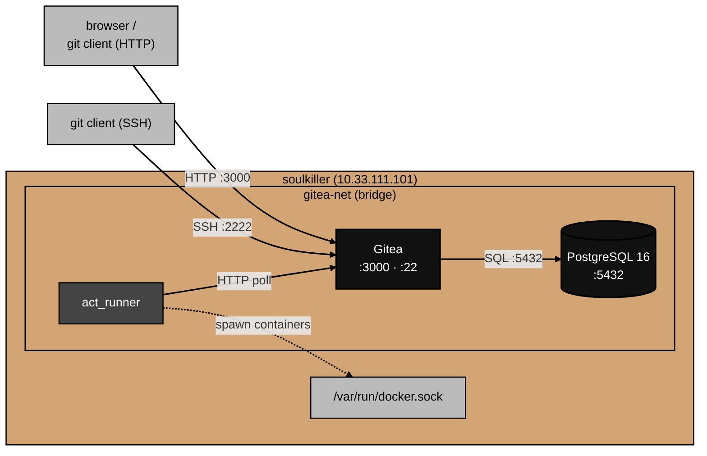

# Architecture

What the Gitea stack actually is, component by component.

This doc describes how the pieces fit together, where data flows, and what each part stores on disk.
For why specific choices were made, see [decisions.md](decisions.md).
For things that broke during the build, see [gotchas.md](gotchas.md).

## Component overview

The stack has three components.

**Gitea** — self-hosted Git service.
Handles repository hosting, user management, issue tracking, pull requests, and Gitea Actions pipeline definitions.
Exposes a web UI on port 3000 and an SSH server on port 22 (mapped to host port 2222).

**PostgreSQL 16** — relational database backend.
Stores all of Gitea's non-repository state: users, repository metadata, issues, comments, pull requests, webhooks, and CI job records.
Git objects (commits, blobs, trees) live on the filesystem in bare repository directories.
Everything else lives here.

**act_runner** — CI runner for Gitea Actions.
Polls Gitea's API for pending workflow jobs, spawns Docker containers to execute job steps, and reports results back.
Communicates with Docker via the host socket at `/var/run/docker.sock`.

## Topology

All three services run on `soulkiller` in a single Docker Compose project.
They share a dedicated bridge network (`gitea-net`).



act_runner connects to Gitea via the host's external address (`http://soulkiller.home.arpa:3000`) rather than the internal Compose service name (`http://gitea:3000`).
The reason is that act_runner spawns job containers on the host's default Docker network, not on `gitea-net`.
Those job containers cannot resolve Compose service names, so `GITEA_INSTANCE_URL` must be an address reachable from outside the Compose network.
Using the FQDN works from both act_runner itself and from inside the job containers it spawns.

`soulkiller` also runs a separate monitoring agent stack at `/opt/monitoring-agents/` (node_exporter, cAdvisor, Alloy).
That is an independent Compose project; restarting Gitea does not affect the monitoring agents and vice versa.

## Data flow

### Code push

A git push arrives at host port 2222 (SSH) or port 3000 (HTTP).
Gitea writes the received objects to the bare repository at `/opt/gitea/data/repositories/<user>/<repo>.git/`.
It records the push event in PostgreSQL, updating refs, branch heads, and the commit log.
If a workflow file exists at `.gitea/workflows/*.yml` on the pushed branch, Gitea creates a CI job record in PostgreSQL.

### CI pipeline run

act_runner polls Gitea's API for pending jobs on a short interval.
When it claims a job, it reads the workflow YAML from the repository, pulls any required Docker images, and spawns containers to run each step.
Job containers run on the host's default Docker network because they are spawned directly through the Docker socket, not through Compose.
act_runner streams step output back to Gitea as the job runs and writes the final status when the job completes.

## On-disk layout

All persistent state lives under `/opt/gitea/` on `soulkiller` as bind mounts:

```
/opt/gitea/
├── docker-compose.yml          → /opt/home.arpa/gitea/docker-compose.yml (symlink)
├── .env                        # secrets (not committed, root-owned)
├── data/                       # git repos (bare), LFS objects, attachments
├── config/                     # app.ini and Gitea config files
├── postgres/                   # PostgreSQL data files
└── runner/                     # act_runner registration state and job workspace

/opt/home.arpa/                 # clone of the home.arpa repo (HTTPS)
```

`docker-compose.yml` is a symlink into the repo clone.
To deploy a change: update the repo on silverhand, push, then `sudo git -C /opt/home.arpa pull` on soulkiller.
See [docs/architecture.md](../../docs/architecture.md) for the full config management pattern.

`data/` grows over time.
Every git object is stored as a bare repository under `data/repositories/`.
LFS objects land in `data/lfs/` if LFS is enabled.

`config/` contains `app.ini`, Gitea's primary config file.
Changes to `app.ini` require a container restart to take effect.

`postgres/` is owned by the PostgreSQL process and is not human-readable without `psql`.
The practical way to back it up is `pg_dump`, not snapshotting this directory while the service is running.

`runner/` contains the runner's registration token state and temporary job workspaces.
Workspaces are cleaned up after each job completes.

## Operational endpoints

| What         | Address                            |
| ------------ | ---------------------------------- |
| Gitea web UI | `http://soulkiller.home.arpa:3000` |
| Gitea SSH    | `ssh://soulkiller.home.arpa:2222`  |

To view service logs, run from `/opt/gitea/` on `soulkiller`:

```bash
docker compose logs -f           # all services
docker compose logs -f gitea     # Gitea only
docker compose logs -f runner    # act_runner only
```

To restart a service after a config change:

```bash
docker compose restart gitea
```
