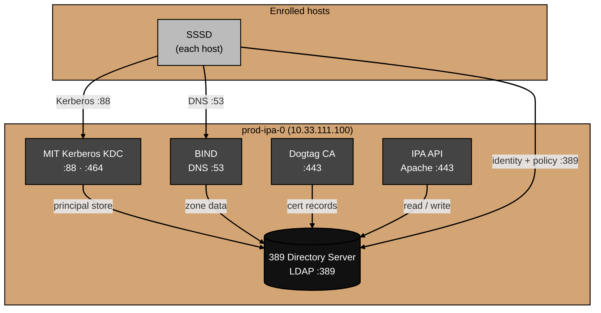

# Architecture

What the FreeIPA stack actually is, component by component.

This doc describes how the pieces fit together, how authentication flows, and where state lives.
For why specific choices were made, see [decisions.md](decisions.md).
For things that broke during the build, see [gotchas.md](gotchas.md).

## Component overview

FreeIPA is not a single service — it is a tightly integrated bundle of four independent open-source projects, all wired together at install time.

**389 Directory Server** — the central data store.
An LDAP server that holds every piece of data the stack manages: user accounts, group memberships, host objects, HBAC rules, sudo rules, DNS zone records, and certificate metadata.
Every other component in the stack reads from and writes to 389-DS.
It is the source of truth for the entire identity system.

**MIT Kerberos KDC** — the authentication service.
Issues Kerberos tickets to users and services.
The principal database is stored in 389-DS via a plugin, so Kerberos data lives in LDAP alongside everything else.
Listens on port 88 (TCP/UDP) and port 464 (TCP/UDP) for password changes.

**BIND** — the DNS authority.
Serves as the authoritative nameserver for the `home.arpa` domain.
Zone data is read from 389-DS via the `bind-dyndb-ldap` plugin — DNS records live in LDAP, not in flat zone files.
When a host enrolls as an IPA client, its DNS records are added to LDAP and BIND serves them automatically.
Listens on port 53 (TCP/UDP).

**Dogtag PKI** — the certificate authority.
Issues X.509 certificates for the IPA web UI, host keytabs, and any services that request certificates via IPA.
Certificate records are stored in 389-DS.
The CA's signing key lives in an NSS database on disk under `/var/lib/pki/`.

**Apache / IPA API** — the management layer.
A Python application running under Apache (mod_wsgi) that exposes both a web UI and an XML-RPC API.
All `ipa` CLI commands and web UI operations go through this API, which translates them into LDAP operations against 389-DS.
Listens on port 443.

**SSSD** — the client-side identity agent.
Runs on every enrolled host, including `prod-ipa-0` itself.
Handles PAM authentication (Kerberos), NSS identity lookups (LDAP), HBAC enforcement, sudo policy retrieval, and SSH host key serving.
SSSD caches identity and policy data locally, which allows enrolled hosts to continue functioning for a limited time if `prod-ipa-0` is unreachable.

## Topology

389-DS sits at the center of the server.
Every other server-side component connects to it.



This stack runs as a single-master deployment.
There is no replica.
If `prod-ipa-0` goes down, enrolled hosts can continue operating from SSSD's local cache for a limited time, but new authentication against the KDC and fresh policy lookups will fail until the server comes back.

## Authentication flow

What happens when a user logs in to an enrolled host over SSH:

1. SSH daemon receives the connection and passes it to PAM.
2. PAM calls the SSSD PAM module (`pam_sss`).
3. SSSD checks its local cache for an HBAC policy that governs `sshd` access for this user on this host.
   If the cache is stale, SSSD fetches the current HBAC rules from 389-DS over an authenticated LDAP connection.
4. If HBAC permits access, SSSD contacts the Kerberos KDC on `prod-ipa-0:88` to authenticate the user.
5. The KDC looks up the user's principal in 389-DS, verifies the credential, and issues a Ticket Granting Ticket (TGT).
6. SSSD caches the TGT and returns success to PAM.
7. The user's session starts.
   Their identity (UID, GID, home directory) comes from SSSD's NSS module, which reads from the local LDAP cache or fetches it from 389-DS if stale.

If the user runs `sudo`, SSSD fetches the applicable sudo rules from LDAP, evaluates them, and permits or denies the command.
HBAC and sudo rules are evaluated independently — both must permit access for a privileged session to succeed.

## DNS integration

FreeIPA's BIND integration is tighter than just "IPA manages DNS records."
BIND reads zone data directly from LDAP — there are no traditional flat zone files.
The `bind-dyndb-ldap` plugin connects to 389-DS at startup and keeps its in-memory zone data synchronized.

When a new host enrolls via `ipa-client-install`:

1. The enrollment process creates a host object in 389-DS.
2. DNS A and PTR records are written to the LDAP DNS zone (`idnszone=home.arpa.`).
3. BIND picks up the new records automatically — no zone reload required.
4. The client sets `prod-ipa-0` (`10.33.111.100`) as its primary DNS server.

SRV records in the `home.arpa` zone allow clients to discover IPA services without hardcoding the server address:

```
_kerberos._tcp.home.arpa.    SRV  0 100 88  prod-ipa-0.home.arpa.
_ldap._tcp.home.arpa.        SRV  0 100 389 prod-ipa-0.home.arpa.
_kerberos.home.arpa.         TXT  "HOME.ARPA"
```

If these records don't resolve correctly, client enrollment fails.
Verify with:

```bash
dig _kerberos._tcp.home.arpa SRV
dig _ldap._tcp.home.arpa SRV
```

## On-disk layout

FreeIPA's state is spread across several standard system paths on `prod-ipa-0`:

```
/etc/ipa/                   # client and server config, CA certificate bundle
/etc/dirsrv/                # 389-DS instance config
/var/lib/dirsrv/            # 389-DS data files (LDAP database)
/var/named/                 # BIND runtime files (no flat zone files — data comes from LDAP)
/var/lib/pki/               # Dogtag CA NSS database and key material
/var/log/dirsrv/            # 389-DS access and error logs
/var/log/pki/               # Dogtag CA logs
/var/log/krb5kdc.log        # Kerberos KDC log
```

The files committed in this repo (`chrony.conf`, `default.conf`, `firewall-rules.txt`, `sssd.conf`) are reference copies of the server's runtime configuration.
They are not automatically applied — they document what's running on the host.

`/var/lib/dirsrv/` is the primary backup target.
It contains the full LDAP database, which holds all user accounts, policies, DNS records, and certificate metadata.
A backup of that directory (taken while the 389-DS service is stopped, or via `dsconf` online backup) covers the entire identity state.

## Operational endpoints

| What              | Address                                    |
| ----------------- | ------------------------------------------ |
| IPA web UI        | `https://prod-ipa-0.home.arpa/ipa/ui`      |
| IPA XML-RPC API   | `https://prod-ipa-0.home.arpa/ipa/xml`     |
| LDAP              | `ldap://prod-ipa-0.home.arpa:389`          |
| Kerberos KDC      | `prod-ipa-0.home.arpa:88`                  |
| DNS               | `prod-ipa-0.home.arpa:53`                  |

Before running `ipa` CLI commands, a valid Kerberos ticket is required:

```bash
kinit admin        # or kinit arpatek
ipa user-find      # example command
```

Tickets expire.
If an `ipa` command returns `Ticket expired`, run `kinit` again.
