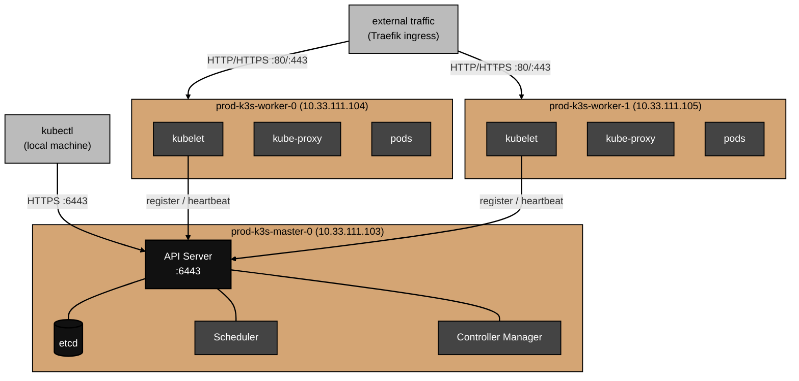

# Architecture

What this k3s cluster actually is, how the components fit together, and how workloads run.

For why specific choices were made, see [decisions.md](decisions.md).
For things that broke during setup, see [gotchas.md](gotchas.md).

## What k3s is

k3s is a fully conformant Kubernetes distribution packaged as a single binary.
It implements the full Kubernetes API.
Anything that runs on full Kubernetes runs on k3s.
The difference is in the packaging: k3s bundles containerd (container runtime), Flannel (CNI), Traefik (ingress), CoreDNS (cluster DNS), and SQLite or etcd (cluster state store) into one binary rather than requiring each to be installed separately.

For a homelab, this means a working cluster in minutes rather than hours.
For production, the tradeoffs of k3s versus full Kubernetes are covered in [decisions.md](decisions.md).

## Component overview

### Control plane (prod-k3s-master-0)

The master runs the Kubernetes control plane — the components that manage cluster state:

**API Server** — the single entry point for all cluster operations.
Every `kubectl` command, every controller, and every node agent communicates with the cluster exclusively through the API server.
It runs over HTTPS on port 6443.

**etcd** — the cluster's database.
Stores all cluster state: what nodes exist, what pods are running, what deployments are defined, what secrets are stored.
If etcd is lost, the cluster state is lost (though workloads continue running until the nodes are restarted).

**Scheduler** — decides which node a new pod runs on.
It evaluates resource requests, node taints, node selectors, and affinity rules to find the best fit.
The master is tainted `control-plane:NoSchedule`, so the scheduler never places workloads there.

**Controller Manager** — watches the cluster state and reconciles it toward the desired state.
If a pod crashes, the controller manager notices the replica count is wrong and creates a replacement.
If a node goes offline, it marks its pods as failed and reschedules them.

### Worker nodes (prod-k3s-worker-0, prod-k3s-worker-1)

Each worker runs two components:

**kubelet** — the node agent.
Receives pod specifications from the API server, tells containerd to pull images and start containers, and reports node and pod health back to the control plane.

**kube-proxy** — handles network routing for Kubernetes services.
When you create a Service, kube-proxy programs iptables rules on each node so that traffic to the service's ClusterIP gets routed to the correct pod endpoints.

### Cluster-wide components

These run as pods on the worker nodes:

**Flannel** — the Container Network Interface (CNI).
Assigns each node a subnet of the pod network (`10.42.0.0/16` by default in k3s).
Creates a virtual overlay network so pods on different nodes can communicate directly by IP.
A pod on worker-0 can reach a pod on worker-1 at its pod IP without any extra configuration.

**CoreDNS** — DNS for the cluster.
Every pod gets a `/etc/resolv.conf` pointing at CoreDNS.
Service names like `my-service.my-namespace.svc.cluster.local` resolve to the service's ClusterIP.
This is how services discover each other inside the cluster.

**Traefik** — the ingress controller.
Sits at the edge of the cluster and routes external HTTP/HTTPS traffic to the right service based on hostname or path rules.
Runs on the worker nodes with a DaemonSet, so it's active on both workers.

## Topology



## How a workload runs

When you run `kubectl apply -f deployment.yaml`:

1. `kubectl` sends the manifest to the API server over HTTPS.
2. The API server validates it and writes it to etcd.
3. The controller manager notices a new Deployment exists and creates the specified number of ReplicaSets and Pods.
4. The scheduler sees unscheduled pods and assigns them to worker nodes (never the master, due to the taint).
5. The kubelet on each assigned worker receives the pod spec, pulls the container image via containerd, and starts the container.
6. The pod gets an IP from Flannel's pod subnet.
7. CoreDNS registers the pod's backing service name so other pods can reach it by name.
8. If an Ingress rule exists, Traefik starts routing external traffic to the pod.

## On-disk layout

State on the master:

```
/etc/rancher/k3s/
└── k3s.yaml                    # kubeconfig (readable by non-root, mode 644)

/var/lib/rancher/k3s/
├── server/
│   ├── node-token              # token used by workers to join the cluster
│   ├── tls/                    # API server TLS certificates
│   └── db/                     # etcd data directory
└── agent/                      # kubelet and containerd state
```

State on each worker:

```
/var/lib/rancher/k3s/
└── agent/
    ├── containerd/             # container images and layer cache
    └── pods/                   # pod volumes and mounts
```

## Operational commands

```bash
# Cluster status
kubectl get nodes
kubectl get pods -A              # all pods across all namespaces

# Check what's running on a specific node
kubectl get pods -A -o wide --field-selector spec.nodeName=prod-k3s-worker-0.home.arpa

# Verify master taint is still in place
kubectl describe node prod-k3s-master-0.home.arpa | grep Taint

# k3s service logs on the master
ssh arpatek@10.33.111.103 "sudo journalctl -u k3s -f"

# k3s agent logs on a worker
ssh arpatek@10.33.111.104 "sudo journalctl -u k3s-agent -f"
```
