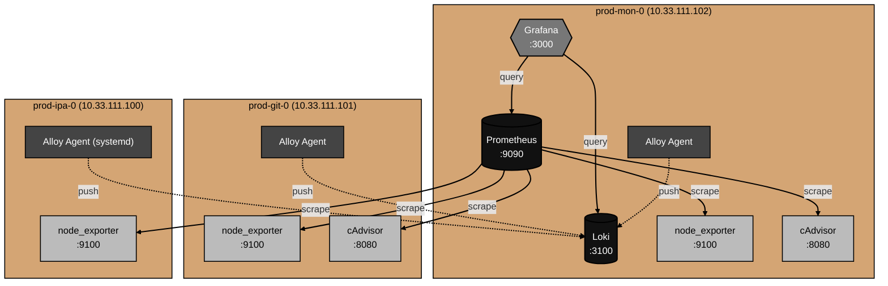

# Architecture

What this monitoring stack actually is, component by component.

This doc is descriptive: it explains how the pieces fit together, where data flows, and what each part stores on disk.
For why specific choices were made, see [decisions.md](decisions.md).
For things that broke during the build, see [gotchas.md](gotchas.md).

## Component overview

The stack has six distinct components.
Each does one thing.

**Prometheus** — time-series database and metrics scraper.
Pulls metrics from HTTP endpoints on a schedule, stores them in a local TSDB, answers queries in PromQL.

**Loki** — log database.
Receives logs pushed from agents, indexes only the labels (not the content), stores compressed chunks on the filesystem.
Answers queries in LogQL.

**Grafana** — visualization layer.
Queries Prometheus and Loki, renders dashboards, lets operators explore data interactively.
Configured via provisioning files, not the UI.

**Alloy** — log shipping agent.
Reads logs from local sources (Docker container stdout, journald) and pushes them to Loki over HTTP.
Replaces Promtail, which Grafana Labs deprecated in February 2026.

**node_exporter** — host metrics exporter.
Exposes a Prometheus-format HTTP endpoint with information about the host's CPU, memory, disk, network, and filesystem state.
Runs on every host.

**cAdvisor** — container metrics exporter.
Exposes a Prometheus-format HTTP endpoint with information about every container running on the host.
Runs on every host that has Docker.

## Topology

The stack is hub-and-spoke.
One central host (`prod-mon-0`) holds the storage and visualization layer.
Every other host runs lightweight agents that report into the central server.



The shading distinguishes component roles.
Storage and core ingest paths are darkest (Prometheus, Loki).
The visualization layer is mid-gray (Grafana).
Agents that ship data outward are darker gray (Alloy).
Exporters that expose data for scraping are lightest (node_exporter, cAdvisor).

Hosts are unaware of each other.
Agents only know about the central server.
The central server knows about all agents through its scrape configs.

## Data flow

The stack uses two opposite data-flow models, one per data type.

### Metrics: pull

Prometheus actively scrapes HTTP endpoints on a schedule (default 15 seconds).
Every scrape target exposes a `/metrics` endpoint that returns plain-text Prometheus exposition format.
Prometheus parses the response, stores the samples in its TSDB, and moves on.

The scrape targets in this stack are:

- `prod-mon-0.home.arpa:9100` — local node_exporter
- `prod-mon-0.home.arpa:8080` — local cAdvisor
- `prod-git-0.home.arpa:9100` — remote node_exporter
- `prod-git-0.home.arpa:8080` — remote cAdvisor
- `prod-ipa-0.home.arpa:9100` — remote node_exporter

The scrape interval and timeout are configured per job in `server/prometheus/prometheus.yml`.
All current jobs use the global defaults.

### Logs: push

Alloy reads logs locally (from Docker container stdout files, or from journald) and pushes them to Loki over HTTP.
The push endpoint is `http://prod-mon-0.home.arpa:3100/loki/api/v1/push`.

On Docker hosts, Alloy discovers running containers automatically and tails their stdout from `/var/lib/docker/containers/<id>/<id>-json.log`.
On the RHEL host, Alloy reads from the systemd journal directly using its `loki.source.journal` component.

Each pushed log line carries labels.
The minimum label set is `host` (set per agent — `prod-mon-0`, `prod-git-0`, `prod-ipa-0`) and `service` or `unit` (set from container name or systemd unit).
These labels are what Loki indexes; the log content itself is stored as a compressed chunk and searched at query time.

### Queries: Grafana to both backends

Grafana is the only thing that queries Prometheus or Loki directly.
It connects to:

- `http://prometheus:9090` — Prometheus, via the internal Compose network
- `http://loki:3100` — Loki, via the internal Compose network

Both connections use the Compose service name as the hostname, not the FQDN.
Inside the Compose network, service names resolve via Docker's embedded DNS.
This means Grafana doesn't need to know about `home.arpa` at all for its query traffic.

## Networking and DNS

The stack uses two distinct hostname resolution paths.

### External traffic uses FQDNs

When Prometheus scrapes a remote host, or when Alloy on a remote host pushes to the central Loki, the request goes over the home.arpa network.
The hostnames in those configs are FQDNs:

- Prometheus scrape targets: `prod-git-0.home.arpa:9100`, `prod-ipa-0.home.arpa:9100`, etc.
- Alloy push URLs from remote hosts: `http://prod-mon-0.home.arpa:3100/loki/api/v1/push`

Resolution happens through the FreeIPA-managed BIND server at `10.33.111.100` (with Pi-hole at `10.33.111.141` as fallback).
This is the same DNS path every other service in the lab uses.

### Internal traffic uses Compose service names

Inside `prod-mon-0`'s Compose network, services talk to each other by name:

- Grafana queries Prometheus at `http://prometheus:9090`
- Grafana queries Loki at `http://loki:3100`
- Alloy on `prod-mon-0` pushes to local Loki at `http://loki:3100/loki/api/v1/push`

Docker's embedded DNS handles these names.
A container in the `monitoring` network can resolve `prometheus`, `loki`, `grafana`, etc., to other containers in the same network.
This is faster than going through external DNS and doesn't depend on the home.arpa zone being healthy.

The reason for the split is that internal service-to-service traffic shouldn't depend on external DNS — if BIND on `prod-ipa-0` ever fails, Grafana on `prod-mon-0` should still be able to query the local Prometheus.

### Why the central server uses an FQDN for its own scrape target

The Prometheus config on `prod-mon-0` scrapes its own local node_exporter at `prod-mon-0.home.arpa:9100`, not at `localhost:9100` or via Compose service names.
Reasoning: the scrape target labels in Prometheus end up in every metric.
Using the FQDN means metrics from the central host's local exporters look identical to metrics from remote hosts — same `instance` label format, same dashboard variables work everywhere.
Using `localhost` would create an asymmetry that would have to be papered over in dashboards.

## On-disk layout

The persistent state of the stack lives in bind-mounted directories on each host.

### prod-mon-0

```
/opt/monitoring/
├── docker-compose.yml
├── prometheus/
│   ├── config/
│   │   └── prometheus.yml
│   └── data/                # TSDB chunks, ~hundreds of MB at 90d retention
├── loki/
│   ├── config/
│   │   └── loki.yml
│   └── data/                # log chunks and tsdb index
├── grafana/
│   ├── config/
│   │   └── provisioning/    # datasources, dashboards (yml + json)
│   └── data/                # internal sqlite, plugin state, image cache
└── alloy/
    └── config/
        └── config.alloy
```

`docker-compose.yml` defines all six services (Prometheus, Loki, Grafana, Alloy, cAdvisor, node_exporter).
The agents on this host run as containers in the same Compose project as the storage layer.

Each component has a `config/` directory mounted read-only into its container, and a `data/` directory mounted read-write.
Alloy is the exception — its only persistent state is a positions file (where it left off in each log source) and that lives inside the container's writable layer.

### prod-git-0

```
/opt/monitoring-agents/
├── docker-compose.yml
├── alloy/
│   └── config/
│       └── config.alloy
└── cadvisor/                # currently empty, scaffold-only
```

`docker-compose.yml` is a separate Compose project from `/opt/gitea/`.
This host's primary job is running Gitea; monitoring agents are secondary and operated independently.
Restarting Gitea (for an upgrade or config change) does not bounce the monitoring agents.

The `cadvisor/` directory exists from initial scaffolding but cAdvisor doesn't use a config file — it takes everything via command-line flags in the Compose file.
The directory is harmless to keep and could be removed.

### prod-ipa-0

No `/opt/monitoring*` directory.
Configs and binaries live in standard FHS paths:

```
/etc/alloy/config.alloy                  # 647 bytes, root-owned
/etc/systemd/system/alloy.service        # systemd unit
/etc/systemd/system/node_exporter.service
/usr/local/bin/alloy                     # binary
/usr/local/bin/node_exporter             # binary
```

This host runs the agents as native systemd services rather than as containers.
Configs live in `/etc`, binaries in `/usr/local/bin`, units in `/etc/systemd/system` — the standard Linux file hierarchy.
The `node_exporter` user owns its own binary; Alloy runs as the `alloy` user with `systemd-journal` as a supplementary group so it can read journald.

## Operational endpoints

How to reach the stack as an operator.

| What                      | URL                                    |
| ------------------------- | -------------------------------------- |
| Grafana web UI            | `http://prod-mon-0.home.arpa:3000`     |
| Prometheus web UI         | `http://prod-mon-0.home.arpa:9090`     |
| Loki API (no UI)          | `http://prod-mon-0.home.arpa:3100`     |
| Alloy debug UI (per host) | `http://<host>.home.arpa:12345`        |
| node_exporter raw metrics | `http://<host>.home.arpa:9100/metrics` |
| cAdvisor raw metrics      | `http://<host>.home.arpa:8080/metrics` |

For day-to-day operation, only Grafana matters — every other UI is for debugging.

To read the logs of the stack itself:

- On `prod-mon-0`: `docker compose logs -f` from `/opt/monitoring/`
- On `prod-git-0`: `docker compose logs -f` from `/opt/monitoring-agents/`
- On `prod-ipa-0`: `journalctl -u alloy -f` and `journalctl -u node_exporter -f`

To restart a service:

- Containerized: `docker compose restart <service>` from the relevant compose directory
- systemd: `systemctl restart alloy` or `systemctl restart node_exporter` on `prod-ipa-0`

To verify Prometheus is scraping all targets, visit `http://prod-mon-0.home.arpa:9090/targets`.
Every target should show `UP` in green.
Anything else is a connectivity, DNS, or firewall problem.
