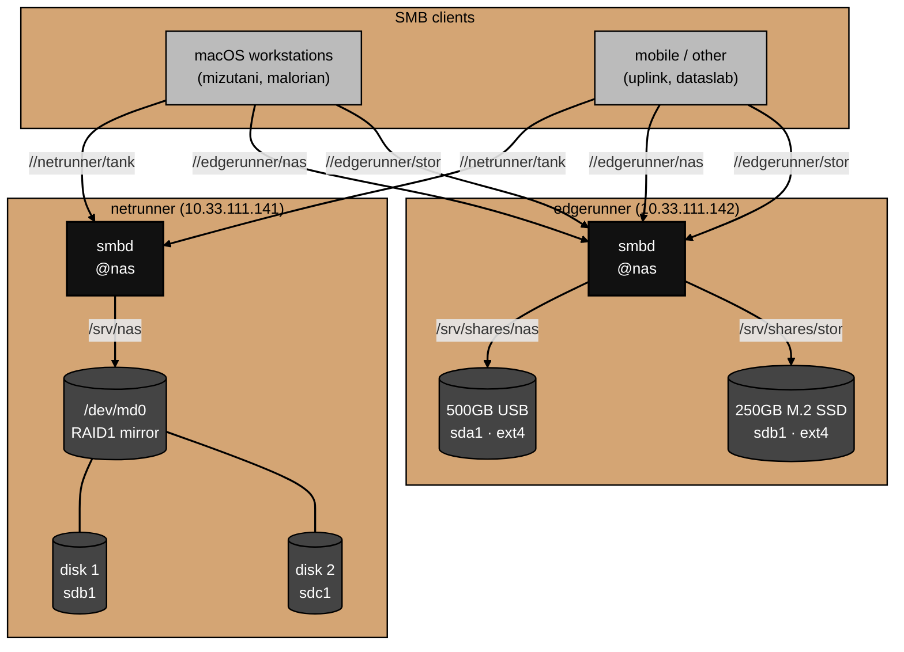

# Architecture

What the NAS actually is and how storage flows from disk to client.

For why specific choices were made, see [decisions.md](decisions.md).
For things that broke during setup, see [gotchas.md](gotchas.md).

## Layers

Network storage on each Pi is three layers stacked from disk upward:

**Block devices** — the physical disks.
On `netrunner`, two USB-attached drives combined into a single `mdadm` RAID1 array (`/dev/md0`).
On `edgerunner`, two independent disks: the ex-`netrunner` USB drive and an M.2 SATA SSD (bridged to USB3 by the Argon ONE M.2 case).

**Filesystem** — `ext4` on each store, mounted by UUID via `/etc/fstab`.
The RAID1 array presents as one `ext4` filesystem (`LABEL=tank`) despite being two physical disks.

**Samba** — exports the mounted filesystem over SMB to network clients.
One share stanza per mounted store, gated by the `nas` group.

## Share topology



## RAID1 on netrunner

`mdadm` assembles two USB drives into a single mirrored array. Every write goes to both disks; a read can be served from either. One disk can fail and the array keeps serving, degraded, until the failed member is replaced and resynced.

```
sdb ─┐
     ├─ md0 (raid1) ── ext4 (LABEL=tank) ── /srv/nas
sdc ─┘
```

The array is defined in three places, all of which must agree for a clean boot:

| Location                          | Purpose                                             |
| --------------------------------- | --------------------------------------------------- |
| `/etc/mdadm/mdadm.conf`           | `ARRAY /dev/md/0 ... UUID=3302e699:...` — how to reassemble |
| initramfs (`mdadm.conf` embedded) | assemble the array early, before `/srv/nas` mounts  |
| `/etc/fstab`                      | `UUID=c7484eed-... /srv/nas ext4 ... 0 2` — mount the filesystem |

Note the two distinct UUIDs: the **array UUID** (`3302e699:...`, in `mdadm.conf`) identifies the RAID set; the **filesystem UUID** (`c7484eed-...`, in `fstab`) identifies the `ext4` on top of it. They are different layers and both are correct.

Without the `mdadm.conf` entry baked into initramfs, the kernel can auto-assemble the array under an arbitrary name like `/dev/md127`, breaking anything that references `/dev/md0`. This setup has it persisted, so the name is stable across reboots.

## edgerunner disks

Two independent `ext4` filesystems, no RAID:

```
sda1 (500GB USB, LABEL=nas)  ── ext4 ── /srv/shares/nas
sdb1 (250GB M.2 SATA SSD)    ── ext4 ── /srv/shares/stor
```

The M.2 SSD is **not** NVMe — the Pi 4B exposes no PCIe. The Argon ONE M.2 case takes an M.2 **SATA** drive and bridges it to the Pi over internal USB 3.0, so it enumerates as a USB block device (`sdb`), not `/dev/nvme0n1`. Both stores are mounted by UUID with `nofail` — see [gotchas.md](gotchas.md) for why that matters on USB-attached Pi storage.

## Samba

Each mounted store is exported by one share stanza in `/etc/samba/smb.conf`. All three stanzas share the same hardening:

```ini
[<share>]
    path = /srv/...
    valid users = @nas
    force group = nas
    read only = No
    create mask = 0660
    force create mode = 0660
    directory mask = 2770
    force directory mode = 2770
    inherit permissions = yes
    delete veto files = yes
    veto files = /lost+found/._*/.DS_Store/
```

`valid users = @nas` admits any member of the `nas` group. `force group = nas` and the setgid `2770` directory mode keep group ownership consistent as files are written. `veto files` hides `lost+found` and macOS metadata cruft (`._*`, `.DS_Store`) from clients.

The `nas` group is GID `1002` on both hosts — matching GIDs so group ownership is identical if data ever moves between shares. On `netrunner` the group contains `sysadmin` and `arpatek`; on `edgerunner`, only `sysadmin` (the IPA `arpatek` account does not resolve there — see [decisions.md](decisions.md)).

## On-disk layout

```
netrunner:
  /etc/mdadm/mdadm.conf        # RAID array definition
  /etc/fstab                   # UUID=c7484eed-... → /srv/nas
  /srv/nas/                    # tank share root (RAID1 mirror)

edgerunner:
  /etc/fstab                   # UUID=3825072d-... → /srv/shares/nas
                               # UUID=11c64507-... → /srv/shares/stor
  /srv/shares/nas/             # nas share root (migrated data)
  /srv/shares/stor/            # stor share root (M.2 SSD)

both:
  /etc/samba/smb.conf          # share definitions
```
