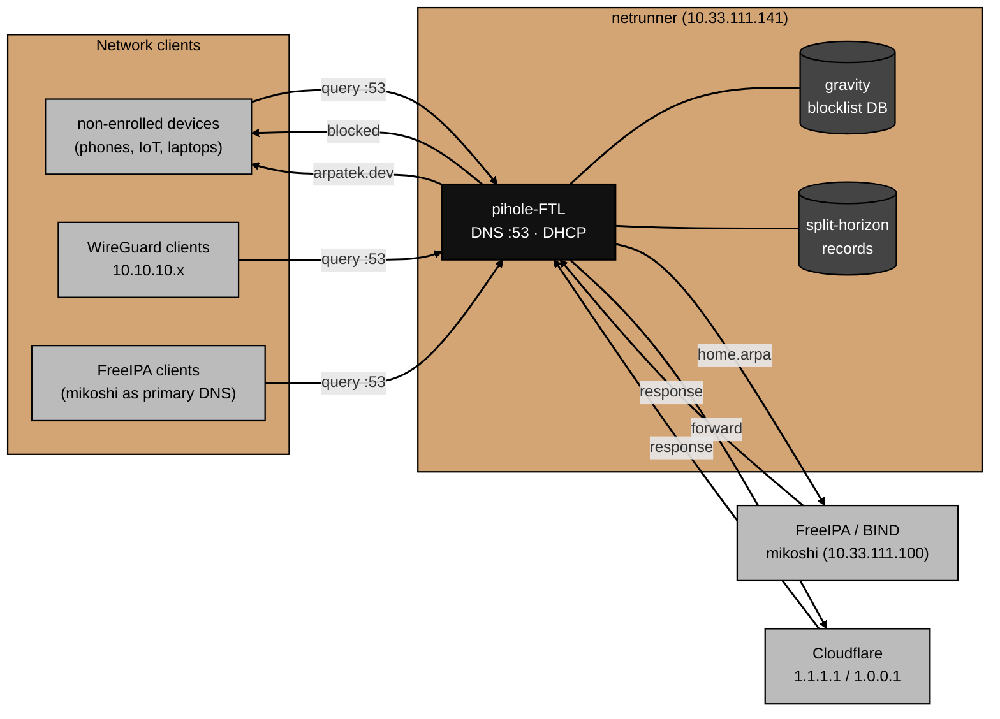
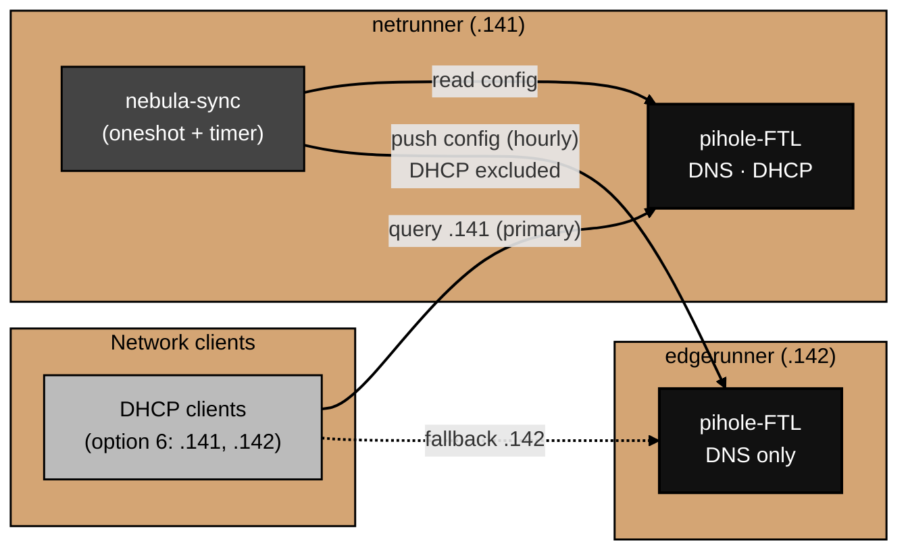

# Architecture

What Pi-hole actually is and how DNS resolution flows through it.

For why specific choices were made, see [decisions.md](decisions.md).
For things that broke during setup, see [gotchas.md](gotchas.md).

## Component overview

Pi-hole v6 consolidated what were previously multiple services into two:

**pihole-FTL** — the core engine.
FTL (Faster Than Light) is a single binary that handles DNS resolution, DHCP, gravity (blocklist) enforcement, query logging, and the JSON API.
It is built on top of dnsmasq and runs as a systemd service.
All DNS queries flow through FTL.

**lighttpd** — the web server.
Serves the admin UI and static assets.
The API itself lives in FTL; lighttpd proxies requests to it.

**SQLite** — query log and gravity database.
FTL writes every DNS query to a local SQLite database.
The gravity database (compiled blocklist) is also SQLite.
The admin UI reads from both.

## DNS resolution flow

Every DNS query from a network device goes through the same path:



1. A client sends a DNS query to `10.33.111.141:53`.
2. FTL checks the query against the gravity blocklist.
   If the domain is blocked, FTL returns `NXDOMAIN` (or the configured block response) immediately — no upstream query.
3. If not blocked, FTL checks its local DNS records.
   The only local records are six `arpatek.dev` split-horizon entries that resolve public subdomains to the internal k3s worker IP (`10.33.111.104`) instead of the public address.
4. `home.arpa` forward queries and reverse lookups for `10.33.111.x` are delegated to FreeIPA (`10.33.111.100`) via `dns.revServers`.
   FreeIPA's BIND is the authoritative nameserver for both zones and stores all records in LDAP.
5. Anything else is forwarded to Cloudflare (`1.1.1.1` / `1.0.0.1`).
   The response is cached and returned to the client.

## Role in the network DNS hierarchy

The lab has two DNS servers with distinct roles:

**FreeIPA BIND** (`mikoshi`, `10.33.111.100`) — authoritative for `home.arpa` and `111.33.10.in-addr.arpa.`.
IPA-enrolled hosts (all lab VMs) use FreeIPA as their primary DNS.
FreeIPA's BIND uses Pi-hole as its upstream forwarder for queries it can't answer locally (installed with `--forwarder=10.33.111.141`).

**Pi-hole** (`netrunner`, `10.33.111.141`) — DNS resolver, content filter, and DHCP server.
Non-enrolled devices use Pi-hole as their sole DNS server.
WireGuard clients use Pi-hole via the tunnel.
`home.arpa` forward queries and `10.33.111.x` reverse lookups are delegated to FreeIPA via `dns.revServers`.

The result: all DNS queries for anything outside `home.arpa` pass through Pi-hole's blocklist, regardless of whether the client is IPA-enrolled or not.

## DHCP

FTL also runs the DHCP server for the `10.33.111.0/24` network — on `netrunner` only.
When a device requests an IP, Pi-hole assigns one from the configured range (`10.33.111.2–254`), sets the gateway to `10.33.111.1`, and advertises **both** Pi-hole instances as DNS servers (`10.33.111.141`, then `10.33.111.142`) via DHCP option 6.
This ensures all devices use Pi-hole for DNS automatically, with the replica as an automatic fallback, without manual client configuration.

## High availability

A second Pi-hole runs on `edgerunner` (`10.33.111.142`). The two instances are **independent standalone resolvers kept configuration-identical** — Pi-hole has no native clustering, no shared state, no quorum. "Redundant Pi-hole" means two boxes deliberately configured the same, not a cluster.



**Roles.**

- `netrunner` (`.141`) — primary. The config source of truth and the **sole DHCP server**.
- `edgerunner` (`.142`) — replica. DNS only; DHCP stays off.

**Config replication (enforce).**
`nebula-sync` runs on `netrunner` as a `oneshot` `systemd` service fired hourly by a timer. Each run reads `netrunner`'s config via the Pi-hole v6 API (Teleporter) and imports the selected sections into `edgerunner`. This is enforcement, not one-time provisioning: like a Puppet agent run, every hour it re-asserts desired state and corrects any drift on the replica.

It syncs DNS settings, resolver config, and gravity (blocklists, groups, clients) — everything that makes the replica a faithful drop-in. It deliberately does **not** sync DHCP (`SYNC_CONFIG_DHCP=false`) or the query database (`SYNC_CONFIG_DATABASE=false`). Excluding DHCP is the critical guard: a full sync would set `dhcp.active=true` on `edgerunner`, and two DHCP servers on one segment issue conflicting leases. The unit files and env template are in [../nebula-sync/](../nebula-sync/).

**Failover (client-side).**
There is no VIP and no failover daemon. Clients receive both resolver addresses via DHCP option 6 and their OS resolver handles fallback: try `.141` first, roll to `.142` on timeout. The redundancy lives in the client's resolver — code already running on every device — and rides in the DHCP lease, which is why the option-6 change must reach clients *before* an outage. If `netrunner` (which also serves DHCP) goes down, existing leases still carry both servers, so clients keep resolving via `edgerunner` until their lease expires.

## On-disk layout

```
/etc/pihole/
└── pihole.toml             # single config file for all Pi-hole settings

/etc/lighttpd/
└── lighttpd.conf           # web server config (managed by Pi-hole installer)

/var/lib/pihole/
├── gravity.db              # compiled blocklist database (rebuilt by pihole -g)
└── pihole-FTL.db           # query log database
```

Pi-hole v6 uses a single `pihole.toml` for all configuration — a significant change from v5, which spread settings across multiple files (`setupVars.conf`, `dnsmasq.d/`, `pihole-FTL.conf`).
