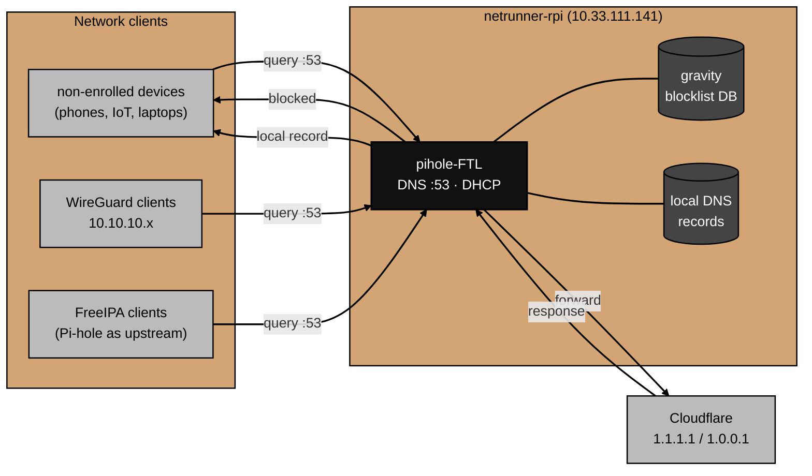

# Architecture

What Pi-hole actually is and how DNS resolution flows through it.

For why specific choices were made, see [decisions.md](decisions.md).
For things that broke during setup, see [gotchas.md](gotchas.md).

## Component overview

Pi-hole v6 consolidated what were previously multiple services into two:

**pihole-FTL** — the core engine.
FTL (Faster Than Light) is a single binary that handles DNS resolution, DHCP, gravity (blocklist) enforcement, query logging, and the JSON API.
It is built on top of dnsmasq and runs as a systemd service.
All DNS queries flow through FTL.

**lighttpd** — the web server.
Serves the admin UI and static assets.
The API itself lives in FTL; lighttpd proxies requests to it.

**SQLite** — query log and gravity database.
FTL writes every DNS query to a local SQLite database.
The gravity database (compiled blocklist) is also SQLite.
The admin UI reads from both.

## DNS resolution flow

Every DNS query from a network device goes through the same path:



1. A client sends a DNS query to `10.33.111.141:53`.
2. FTL checks the query against the gravity blocklist.
   If the domain is blocked, FTL returns `NXDOMAIN` (or the configured block response) immediately — no upstream query.
3. If not blocked, FTL checks its local DNS records.
   `home.arpa` queries for known hosts are answered from local records.
4. Anything else is forwarded to Cloudflare (`1.1.1.1` / `1.0.0.1`).
   The response is cached and returned to the client.

## Role in the network DNS hierarchy

The lab has two DNS servers with distinct roles:

**FreeIPA BIND** (`prod-ipa-0`, `10.33.111.100`) — authoritative for `home.arpa`.
IPA-enrolled hosts (all lab VMs) use FreeIPA as their primary DNS.
FreeIPA's BIND uses Pi-hole as its upstream forwarder for queries it can't answer locally.

**Pi-hole** (`netrunner-rpi`, `10.33.111.141`) — DNS resolver and content filter.
Non-enrolled devices use Pi-hole as their sole DNS server.
WireGuard clients use Pi-hole via the tunnel.
FreeIPA-enrolled clients use Pi-hole indirectly as the upstream forwarder.

The result: all DNS queries for anything outside `home.arpa` pass through Pi-hole's blocklist, regardless of whether the client is IPA-enrolled or not.

## DHCP

FTL also runs the DHCP server for the `10.33.111.0/24` network.
When a device requests an IP, Pi-hole assigns one from the configured range (`10.33.111.2–254`), sets the gateway to `10.33.111.1`, and tells the client to use `10.33.111.141` as its DNS server.
This ensures all devices use Pi-hole for DNS automatically, without manual client configuration.

## On-disk layout

```
/etc/pihole/
└── pihole.toml             # single config file for all Pi-hole settings

/etc/lighttpd/
└── lighttpd.conf           # web server config (managed by Pi-hole installer)

/var/lib/pihole/
├── gravity.db              # compiled blocklist database (rebuilt by pihole -g)
└── pihole-FTL.db           # query log database
```

Pi-hole v6 uses a single `pihole.toml` for all configuration — a significant change from v5, which spread settings across multiple files (`setupVars.conf`, `dnsmasq.d/`, `pihole-FTL.conf`).
