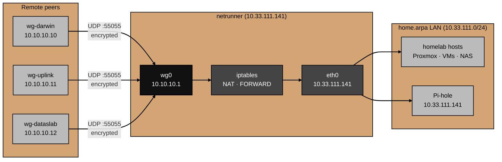

# Architecture

What the WireGuard setup actually is and how traffic flows through it.

This doc describes the network topology, the packet path, and what each piece does.
For why specific choices were made, see [decisions.md](decisions.md).
For things that broke during setup, see [gotchas.md](gotchas.md).

## Component overview

**WireGuard kernel module** — the VPN engine.
Creates a virtual network interface (`wg0`) on `netrunner`.
Handles encryption and decryption of all tunnel traffic using the Noise protocol (Curve25519 key exchange, ChaCha20-Poly1305 encryption, BLAKE2s hashing).
Built into the Linux kernel since 5.6 — no daemon, no userspace process keeping the tunnel alive.

**`wg-quick`** — the configuration layer.
A shell script that reads `/etc/wireguard/wg0.conf` and configures the `wg0` interface, routing, and PostUp/PostDown iptables rules.
Managed as a systemd service (`wg-quick@wg0`).

**iptables** — NAT and packet forwarding.
Masquerades outbound traffic from the `10.10.10.0/24` tunnel subnet behind the Pi's LAN IP (`10.33.111.141`), so LAN devices see a known source address and can route responses back.
Forward rules pass traffic between `wg0` and `eth0` in both directions.
Persisted via `iptables-persistent` so rules survive reboots.

**Cloudflare DDNS client** — stable endpoint for peers.
The home network's public IP is dynamic.
A DDNS client updates a Cloudflare-managed subdomain whenever the IP changes.
Peers connect to the DDNS hostname rather than a raw IP, so they stay connected across IP changes.

## Topology

The setup is hub-and-spoke.
`netrunner` is the hub — all remote peers connect to it.
Peers have no routes to each other; all LAN access goes through the hub.



## Traffic flow

### Inbound (peer → LAN)

1. A remote peer (e.g. `wg-darwin`) sends an encrypted UDP packet to the DDNS hostname on port 55055.
2. The Netgear gateway receives the packet on its public IP and forwards it to `10.33.111.141:55055`.
3. The WireGuard kernel module on `netrunner` decrypts the packet using the peer's public key and delivers it to the `wg0` interface.
4. The kernel checks the source IP against the peer's `AllowedIPs` (`10.10.10.10/32`).
   If it doesn't match, the packet is dropped.
5. The iptables `FORWARD` rule passes the packet from `wg0` to `eth0`.
6. The iptables `POSTROUTING MASQUERADE` rule rewrites the source IP from `10.10.10.10` to `10.33.111.141`.
7. The packet reaches the destination LAN host, which sees it as coming from the Pi.

### Outbound (LAN → peer)

1. The destination LAN host sends its response to `10.33.111.141` (the Pi's LAN IP).
2. The Pi's kernel de-NATs the packet, restoring the original destination (`10.10.10.10`).
3. The iptables `FORWARD` rule (matching `RELATED,ESTABLISHED`) passes the packet from `eth0` back to `wg0`.
4. WireGuard encrypts the packet and sends it as UDP back to the peer's current endpoint.

## Key management

Every peer has a public/private keypair generated with `wg genkey` / `wg pubkey`.
The server also has its own keypair.

Private keys never leave the device that generated them.
The server's private key lives in `/etc/wireguard/wg0.conf` on `netrunner`.
Peer private keys live on each peer device.

Public keys are shared freely — the server's public key is in `wg0.conf.example` in this repo.
Peer public keys are listed in the `[Peer]` sections of the server config and in the README.

WireGuard uses the public keys for both peer authentication and session key derivation.
There is no certificate authority, no pre-shared passwords, and no username/password authentication.

## On-disk layout

```
/etc/wireguard/
└── wg0.conf            # interface config, private key, peer entries

/etc/sysctl.d/
└── 99-wireguard.conf   # net.ipv4.ip_forward=1

/etc/iptables/
├── rules.v4            # iptables-persistent: filter + nat tables
└── rules.v6            # (empty — IPv6 not in use)
```

`wg0.conf` contains the server's private key and is readable only by root (`chmod 600`).
It is the only file on this host that must never be committed to version control.
